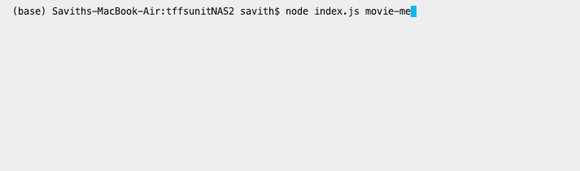
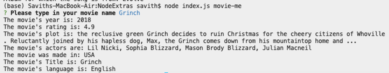
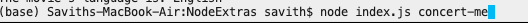
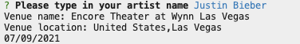
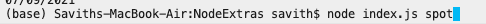
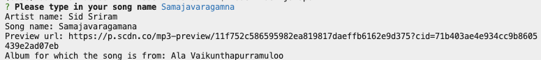

### Movie
* To access my IMBD Api you first have to type in (node index.js movie-me)
* The (movie-me) is the keyword that allows you to run the movie-me program. 
* It should like something like this.

* After inputting your keyword you will have to enter a movie.
* After you do that you will then get your movie information. 

### Bandsintown

* To reach the Bandsintown Api you have to tye in (node index.js concert-me).
* The (concert-me) is the keyword that starts the Bandsintown program. 
* It should look something like this.

* Once you type in your key word, you will need to put in a artist name. 
* After about a second or too information about your artists next concert should appear. 

### Spotify

* To access the spotify api you need to type into the terminal (node index.js spot)
* The (spot) is the keyword for this API.
* It should look something like this

* After you type in the node command a prompt will come up telling you to select a song.
* Once you type in your song and hit enter, all the information about the song from spotify should come up. 

### Surprise

* If you run (node index.js surprise).
* The command word is (surprise).
* It will take whatever command you have in random.txt and run it.
* As for your command line it should look something like this. 

* Thankyou for taking time to look at my project. 

